# dayzero-python-problem-solutions

## Task 2

The contents of this repository can be run and resukts can be fetched by installig becessary Python packages available in requirements.txt. Additionally, we have run the program over ticker symbols provided in ticker_symbols.txt.

This task can be categorized into the following subtasks:
-Subtask 1: Data collection, cleaning and preprocessing
-Subtask 2: Putting the stock data collected into suitable databases
-Subtask 3: Create a Flask REST API for desired routes, query the data and store the required ouput in a CSV file

To accomplish the subtasks the folllowing scripts and algorithms have been created:
-Subtask 1: Data collection and processing using [stockData.py]("stockData.py)
-Subtask 2: Databse creation and insertion using [put_weekly_data.py]("put_weekly_data.py"),[put_data_into_db.py]("put_data_into_db.py") and [test.py]("test.py")
-Subtask 3: Flask REST API using [gainersLosers.py]("gainersLosers.py") and [weekly.py]("weekly.py")

## Subtask 1 (Fetching Data and Preprocessing)

Historic stock data is retrieved from Yahoo Finance in a fashion similar to that in [Task 1]("https://github.com/samarth1029/DayZero_Task1"). 
Thereafter, since the desired table needs to have an id, we modify the pandas dataframe and add id using auto id generating package of Python,uuid whose documentation can be studied from [here]("https://docs.python.org/3/library/uuid.html").
We also add an additional attribute to the dataframe, namely 'high_diff', which is the increment percentage between two consecutive stock dates for each ticker symbol. Note that, a negative sign denotes that there was a decrement in stock prices today (since yesterday).
All the computed data is stored in the data folder as CSV files under this repository.
A sample CSV file in this folder for 'AAPL' looks like this:

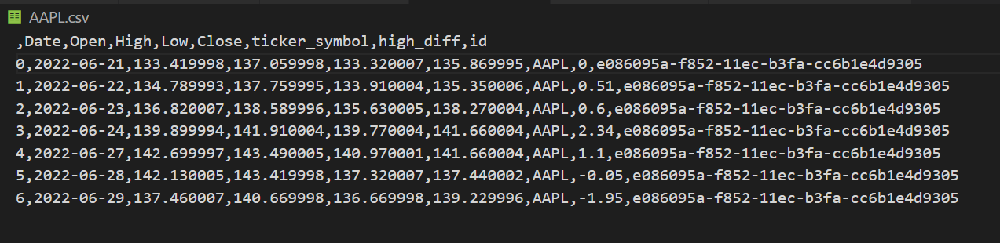

## Subtask 2 (Database Handling)

Here an attempt has been made to create two databases:
-weekStock.db
-stock_model.db

-To create weekStock.db, a Python script [put_weekly_data.py]("put_weekly_data.py") has been written.
*Approach*:

This databse contains one table named 'weekly_stocks' which has records for all ticker symbols over a span of 7 days.
During development, SQLite database has been used. SQLite databases are the most convenient choice for developing small applications, sometimes even not so small ones, as each database is stored in a single file on disk and there is no need to run a database server like MySQL and PostgreSQL.
We first acquire the weekly data and convert it to a pandas data frame.Next, we set up the engine using [SQLAlchemy create_engine]("https://docs.sqlalchemy.org/en/14/core/engines.html").

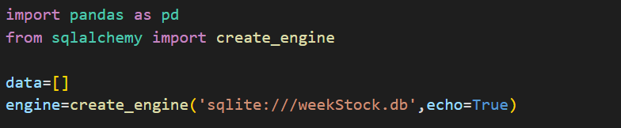

Once this databse is set up, we have a database running an SQL query "SELECT * FROM weekly_stocks" gives the following view(presented as json):

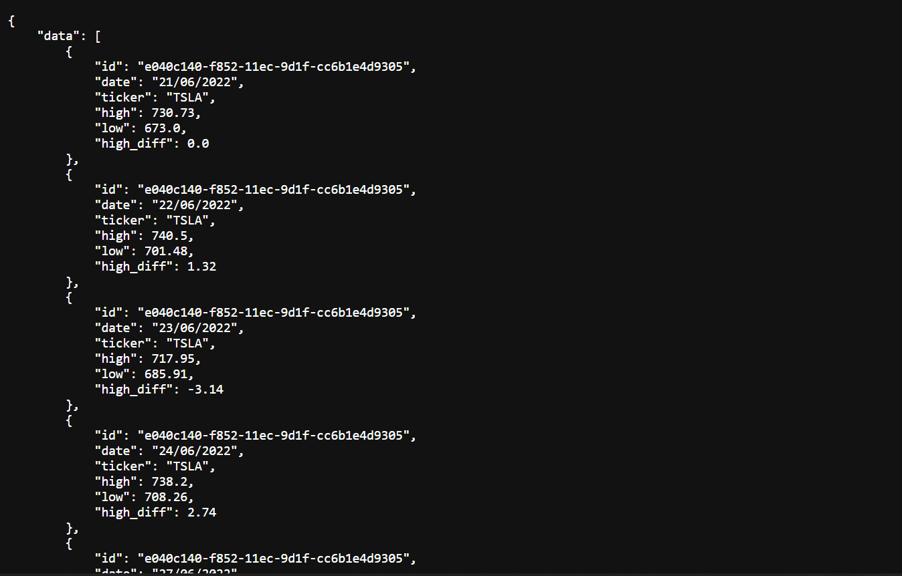

-To create stock_model.db, Python scripts [put_data_into_db.py]("put_data_into_db.py") and [test.py]("test.py") have been written.
*Approach*:

This databse contains one table named 'stock_model' that contains data for the current day for all ticker symbols.
We have two new configuration items to add to the config file:

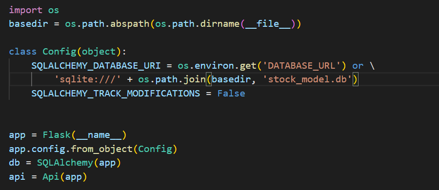

The Flask-SQLAlchemy extension takes the location of the application's database from the SQLALCHEMY_DATABASE_URI configuration variable.It is in general a good practice to set configuration from environment variables, and provide a fallback value when the environment does not define the variable. In this case I'm taking the database URL from the DATABASE_URL environment variable, and if that isn't defined, I'm configuring a database named stock_model.db located in the main directory of the application, which is stored in the basedir variable.
The SQLALCHEMY_TRACK_MODIFICATIONS configuration option is set to False to disable a feature of Flask-SQLAlchemy that I do not need, which is to send a signal to the application every time a change is about to be made in the database.

After this, a Class 'Stocks' has been defined that attempts to process the put request initiated by 'response' variable in [test.py]("test.py):

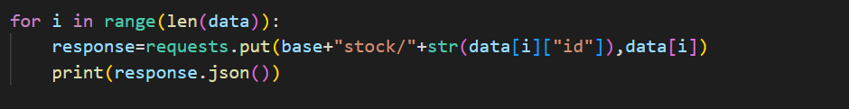

The following is a glimpse at the table in the databse we just created:

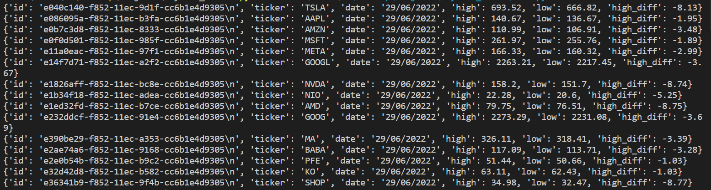

In this way, we have set up all databases,tables and CSVs to proceed with creation of a Flask REST API under Subtask 3.

## Subtask 3 (Flask REST API)

Subtask 3 can be further divided into 3 categories, which accomplish the task of creation of three endpoints/routes/paths:
-/get_top_gainers
 The endpoint returns the top 10 stocks whose price increased as compared to the previous day in a JSON structure.
 This is inside [gainersLosers.py]("gainersLosers.py").
-/get_top_losers
 The endpoint returns the top 10 stocks whose price decreased as compared to the previous day in a JSON structure.
 This is inside [gainersLosers.py]("gainersLosers.py").
-/generate_weekly_report
 The endpoint returns all the stocks with weekly high, low and average price. Furthermore, it creates a CSV file containing the following columns: STOCK, WEEKLY HIGH, WEEKLY LOW and AVERAGE. This is inside [weekly.py]("weekly.py")

Before proceeding any further, we need to define the table structure which is as follows:

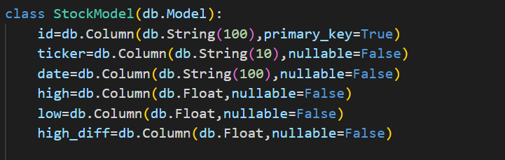

Now,let us dive into the approach for achieving the 3 routes in the API:
-/get_top_gainers
 
 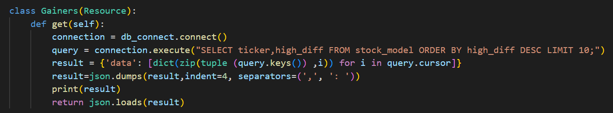

 The code is pretty starightforward. One thing to keep in mind is that after running the SQL query, the result is stored in the form of a Python dictionary, which can't be converted to JSON response directly.So, it is first converted to a json string, which is then converted to the required JSON structure which upon execution, gives the following output:

 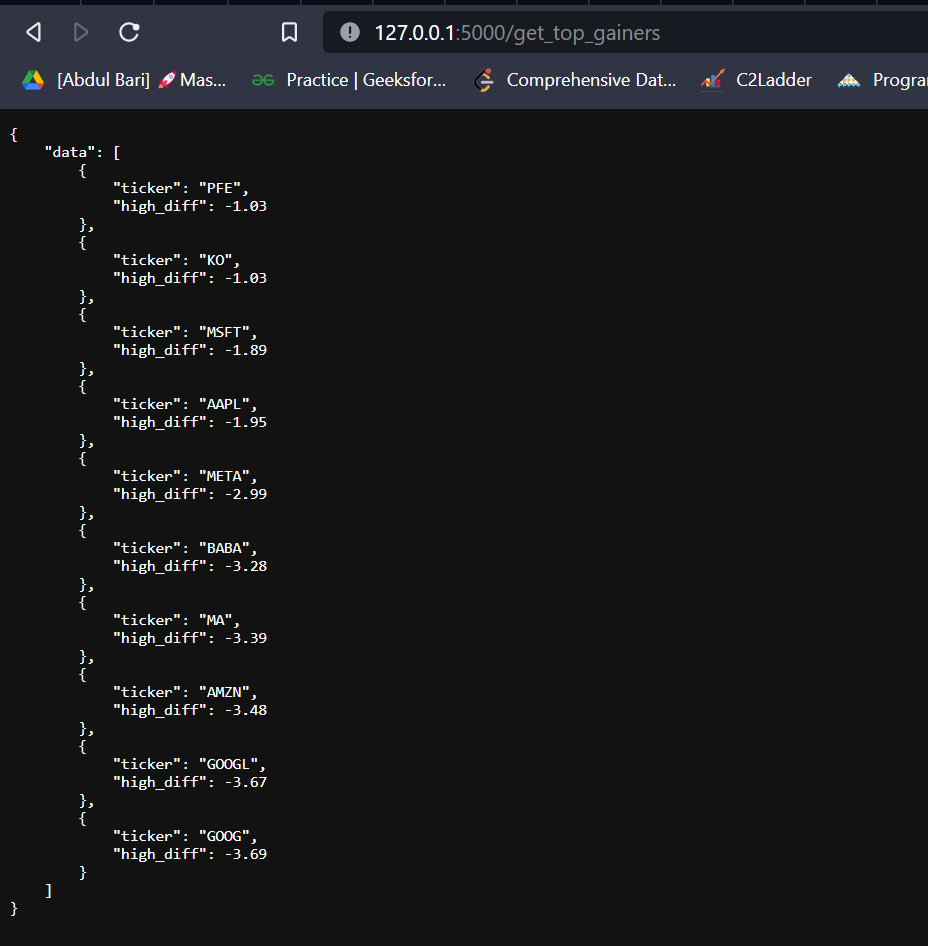

-/get_top_losers
 
 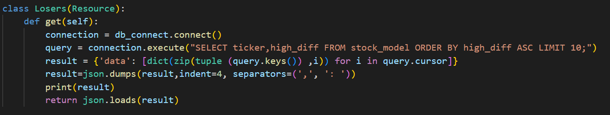

 The code is pretty starightforward. One thing to keep in mind is that after running the SQL query, the result is stored in the form of a Python dictionary, which can't be converted to JSON response directly.So, it is first converted to a json string, which is then converted to the required JSON structure which upon execution, gives the following output:

 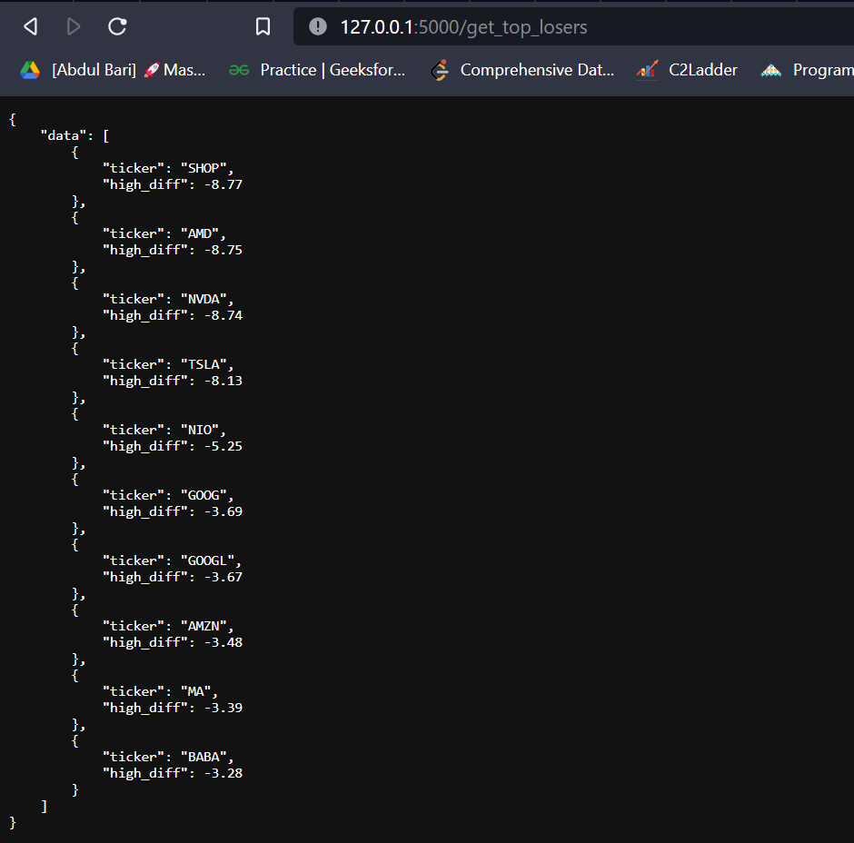

-/generate_weekly_report
 
 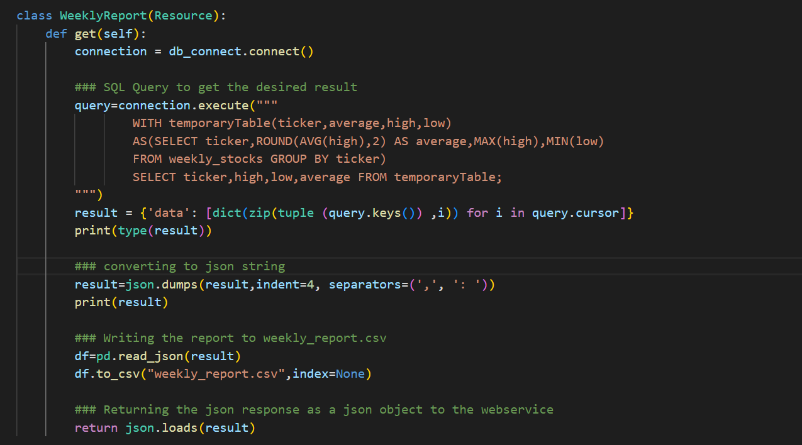

 The code is pretty starightforward.We have built the SQL query using a WITH clause. The SQL WITH clause allows you to give a sub-query block a name (a process also called sub-query refactoring), which can be referenced in several places within the main SQL query. The result is displayed a s a JSON structure, and also stored in a CSV file [weekly_report.csv]("weekly_report.csv"). The JSON response looks like:

 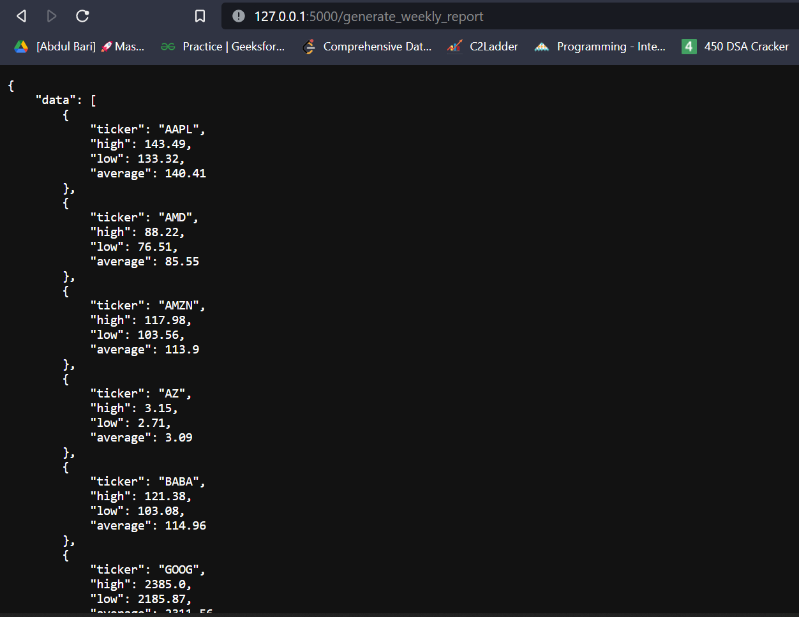

In this way, the entire process of generating metrics for our stock data is completed!!

